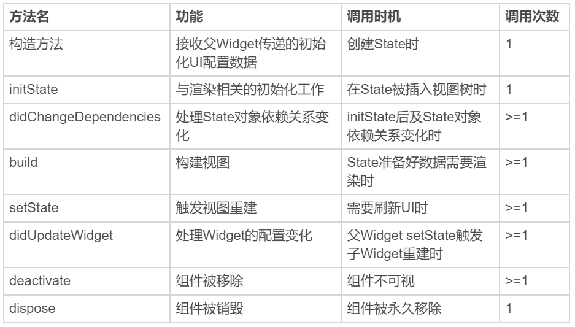
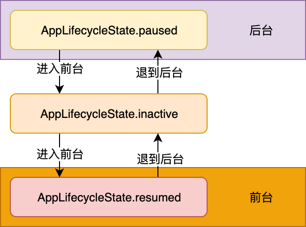

# Flutter基础


## Widget


### Flutter架构图


---


### Widget是什么？

Widget 是 Flutter 功能的抽象描述，是视图的配置信息，同样也是数据的映射，是 Flutter 开发框架中最基本的概念。前端框架中常见的名词，比如视图（View）、视图控制器（View Controller）、活动（Activity）、应用（Application）、布局（Layout）等，在 Flutter 中都是 Widget。

> Flutter 的核心设计思想便是“一切皆 Widget”


### Widget 渲染过程

> 如果用 Vue 来比喻的话，Widget 就是 Vue 的 template；Element 就是 virtual DOM；RenderObject 就是DOM。

Flutter 将视图树的概念进行了扩展，把视图数据的组织和渲染抽象为三部分，即 `Widget`，`Element` 和 `RenderObject`。


- **Widget**

Widget 是 Flutter 世界里对视图的一种结构化描述，可以把它看作是前端中的“控件”或“组件”。Widget 是控件实现的基本逻辑单位，里面存储的是有关视图渲染的配置信息，包括布局、渲染属性、事件响应信息等。

Flutter 将 Widget 设计成不可变的，所以当视图渲染的配置信息发生变化时，Flutter 会选择重建 Widget 树的方式进行数据更新，以数据驱动 UI 构建的方式简单高效。

但这样做的缺点是，因为涉及到大量对象的销毁和重建，所以会对垃圾回收造成压力。不过，Widget 本身并不涉及实际渲染位图，所以它只是一份轻量级的数据结构，重建的成本很低。另外，由于 Widget 的不可变性，可以以较低成本进行渲染节点复用，因此在一个真实的渲染树中可能存在不同的 Widget 对应同一个渲染节点的情况，这无疑又降低了重建 UI 的成本。

- **Element**

Element 是 Widget 的一个实例化对象，它承载了视图构建的上下文数据，是连接结构化的配置信息到完成最终渲染的桥梁。

​	**Flutter 渲染过程，可以分为这么三步**:

​		1、 通过 Widget 树生成对应的 Element 树；

​		2 、创建相应的 RenderObject 并关联到 `Element.renderObject` 属性上；

​		3、 构建成 RenderObject 树，以完成最终的渲染。

Element 同时持有 Widget 和 RenderObject。而无论是 Widget 还是 Element，其实都不负责最后的渲染，只负责发号施令，真正去干活儿的只有 RenderObject。为什么需要增加中间的这层 Element 树呢？因为 Widget 具有不可变性，但 Element 却是可变的。实际上，Element 树这一层将 Widget 树的变化（类似 React 虚拟 DOM diff）做了抽象，可以只将真正需要修改的部分同步到真实的 RenderObject 树中，最大程度降低对真实渲染视图的修改，提高渲染效率，而不是销毁整个渲染视图树重建。这，就是 Element 树存在的意义。

- **RenderObject**

> RenderObject 是主要负责实现视图渲染的对象。

渲染对象树在 Flutter 的展示过程分为四个阶段，即**布局、绘制、合成和渲染**。 其中，布局和绘制在 RenderObject 中完成，Flutter 采用深度优先机制遍历渲染对象树，确定树中各个对象的位置和尺寸，并把它们绘制到不同的图层上。绘制完毕后，合成和渲染的工作则交给 `Skia` 搞定。


---


## Widget中的State

Widget有两种类型：

- StatelessWidget （无状态组件）
  - StatelessWidget 则用于处理静态的、无状态的视图展示
- StatefulWidget（有状态组件）
  - StatefulWidget 应对有交互、需要动态变化视觉效果的场景

> StatelessWidget 不带绑定状态，而 StatefulWidget 带绑定状态。当你所要构建的用户界面不随任何状态信息的变化而变化时，需要选择使用 StatelessWidget，反之则选用 StatefulWidget。前者一般用于静态内容的展示，而后者则用于存在交互反馈的内容呈现中。Widget 是不可变的，更新则意味着销毁 + 重建（build）。StatefulWidget不是万金油，正确评估你的视图展示需求，避免无谓的 StatefulWidget 使用，是提高 Flutter 应用渲染性能最简单也是最直接的手段

Flutter 的视图开发是声明式的，其核心设计思想就是将视图和数据分离，这与 React 的设计思路完全一致。

Flutter 基于声明式的 UI 编程范式

Widget 采用由父到子、自顶向下的方式进行构建


---


## State 生命周期

> State 的生命周期，指的是在用户参与的情况下，其关联的 Widget 所经历的，从创建到显示再到更新最后到停止，直至销毁等各个过程阶段。


State 的生命周期可以分为 3 个阶段：创建（插入视图树）、更新（在视图树中存在）、销毁（从视图树中移除）。

#### 创建

State 初始化时会依次执行 ：构造方法 -> initState -> didChangeDependencies -> build，随后完成页面渲染。

- 构造方法是 State 生命周期的起点，Flutter 会通过调用 StatefulWidget.createState() 来创建一个 State。我们可以通过构造方法，来接收父 Widget 传递的初始化 UI 配置数据。这些配置数据，决定了 Widget 最初的呈现效果。
- initState，会在 State 对象被插入视图树的时候调用。这个函数在 State 的生命周期中只会被调用一次，所以我们可以在这里做一些初始化工作，比如为状态变量设定默认值。
- didChangeDependencies 则用来专门处理 State 对象依赖关系变化，会在 initState() 调用结束后，被 Flutter 调用。
- build，作用是构建视图。经过以上步骤，Framework 认为 State 已经准备好了，于是调用 build。我们需要在这个函数中，根据父 Widget 传递过来的初始化配置数据，以及 State 的当前状态，创建一个 Widget 然后返回。

#### 更新

> Widget 的状态更新，主要由 3 个方法触发：setState、didchangeDependencies 与 didUpdateWidget。一旦这三个方法被调用，Flutter 随后就会销毁老 Widget，并调用 build 方法重建 Widget。

- setState：我们最熟悉的方法之一。当状态数据发生变化时，我们总是通过调用这个方法告诉 Flutter：“我这儿的数据变啦，请使用更新后的数据重建 UI！”
- didChangeDependencies：State 对象的依赖关系发生变化后，Flutter 会回调这个方法，随后触发组件构建。哪些情况下 State 对象的依赖关系会发生变化呢？典型的场景是，系统语言 Locale 或应用主题改变时，系统会通知 State 执行 didChangeDependencies 回调方法。
- didUpdateWidget：当 Widget 的配置发生变化时，比如，父 Widget 触发重建（即父 Widget 的状态发生变化时），热重载时，系统会调用这个函数。

#### 销毁

> 组件销毁相对比较简单。比如组件被移除，或是页面销毁的时候，系统会调用 deactivate 和 dispose 这两个方法，来移除或销毁组件。

- 当组件的可见状态发生变化时，deactivate 函数会被调用，这时 State 会被暂时从视图树中移除。值得注意的是，页面切换时，由于 State 对象在视图树中的位置发生了变化，需要先暂时移除后再重新添加，重新触发组件构建，因此这个函数也会被调用。
- 当 State 被永久地从视图树中移除时，Flutter 会调用 dispose 函数。而一旦到这个阶段，组件就要被销毁了，所以我们可以在这里进行最终的资源释放、移除监听、清理环境，等等。


#### State 生命周期中的方法调用对比




---


## APP生命周期

> 视图的生命周期，定义了视图的加载到构建的全过程，其回调机制能够确保我们可以根据视图的状态选择合适的时机做恰当的事情。而 App 的生命周期，则定义了 App 从启动到退出的全过程。在原生 Android、iOS 开发中，有时我们需要在对应的 App 生命周期事件中做相应处理，比如 App 从后台进入前台、从前台退到后台，或是在 UI 绘制完成后做一些处理。这样的需求，在原生开发中，我们可以通过重写 Activity、ViewController 生命周期回调方法，或是注册应用程序的相关通知，来监听 App 的生命周期并做相应的处理。而在 Flutter 中，我们可以利用 **WidgetsBindingObserver** 类，来实现同样的需求。

##### WidgetsBindingObserver 中具体有哪些回调函数?

> WidgetsBindingObserver 这个类提供的回调函数非常丰富，常见的屏幕旋转、屏幕亮度、语言变化、内存警告都可以通过这个实现进行回调。我们通过给 WidgetsBinding 的单例对象设置监听器，就可以监听对应的回调方法。

```dart
abstract class WidgetsBindingObserver {
  // 页面pop
  Future<bool> didPopRoute() => Future<bool>.value(false);
  // 页面push
  Future<bool> didPushRoute(String route) => Future<bool>.value(false);
  // 系统窗口相关改变回调，如旋转
  void didChangeMetrics() { }
  // 文本缩放系数变化
  void didChangeTextScaleFactor() { }
  // 系统亮度变化
  void didChangePlatformBrightness() { }
  // 本地化语言变化
  void didChangeLocales(List<Locale> locale) { }
  // App生命周期变化
  void didChangeAppLifecycleState(AppLifecycleState state) { }
  // 内存警告回调
  void didHaveMemoryPressure() { }
  // Accessibility相关特性回调
  void didChangeAccessibilityFeatures() {}
}
```

##### 生命周期回调

didChangeAppLifecycleState 回调函数中，有一个参数类型为 AppLifecycleState 的枚举类，这个枚举类是 Flutter 对 App 生命周期状态的封装。它的常用状态包括 `resumed`、`inactive`、`paused` 这三个。

- resumed：可见的，并能响应用户的输入。
- inactive：处在不活动状态，无法处理用户响应。
- paused：不可见并不能响应用户的输入，但是在后台继续活动中。

##### App 切换前后台状态变化示意




##### 帧绘制回调

> 除了需要监听 App 的生命周期回调做相应的处理之外，有时候我们还需要在组件渲染之后做一些与显示安全相关的操作。在 iOS 开发中，我们可以通过 dispatch_async(dispatch_get_main_queue(),^{…}) 方法，让操作在下一个 RunLoop 执行；而在 Android 开发中，我们可以通过 View.post() 插入消息队列，来保证在组件渲染后进行相关操作。在 Flutter 中实现同样的需求会更简单：依然使用万能的 WidgetsBinding 来实现。

WidgetsBinding 提供了单次 Frame 绘制回调，以及实时 Frame 绘制回调两种机制，来分别满足不同的需求：

- 单次 Frame 绘制回调，通过 `addPostFrameCallback` 实现。它会在当前 Frame 绘制完成后进行进行回调，并且只会回调一次，如果要再次监听则需要再设置一次。

  ```dart
  WidgetsBinding.instance.addPersistentFrameCallback((_){
    print("实时Frame绘制回调"); // 每帧都回调
  });
  ```

- 实时 Frame 绘制回调，则通过 `addPersistentFrameCallback` 实现。这个函数会在每次绘制 Frame 结束后进行回调，可以用做 FPS 监测。

  ```dart
  WidgetsBinding.instance.addPersistentFrameCallback((_){
    print("实时Frame绘制回调"); // 每帧都回调
  });
  ```

  