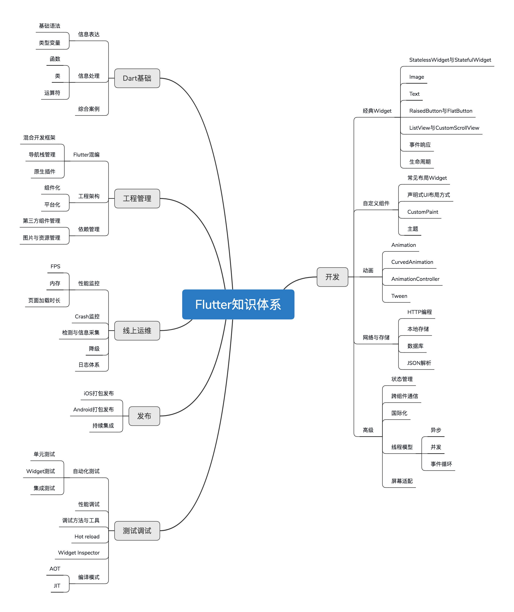

## just for recording flutter-learning.

## Dart是什么？

2011 年 10 月，在丹麦召开的 GOTO 大会上，Google 发布了一种新的编程语言 Dart。如同 Kotlin 和 Swift 的出现，分别是为了解决 Java 和 Objective-C 在编写应用程序的一些实际问题一样，Dart 的诞生正是要解决 JavaScript 存在的、在语言本质上无法改进的缺陷。


## Dart语言核心特性

- 同时支持`JIT`和`AOT`

  - JIT

    JIT，即`Just In Time`，即时编译。JIT 在运行时即时编译，在开发周期中使用，可以动态下发和执行代码，开发测试效率高，但运行速度和执行性能则会因为运行时即时编译受到影响。

  - AOT

    AOT，即`Ahead Of Time`，运行前编译。AOT 即提前编译，可以生成被直接执行的二进制代码，运行速度快、执行性能表现好，但每次执行前都需要提前编译，开发测试效率低

```
总结来讲，在开发期使用 JIT 编译，可以缩短产品的开发周期。Flutter 最受欢迎的功能之一热重载，正是基于此特性。而在发布期使用 AOT，就不需要像 React Native 那样在跨平台 JavaScript 代码和原生 Android、iOS 代码之间建立低效的方法调用映射关系。所以说，Dart 具有`运行速度快、执行性能好`的特点。

那么，如何区分一门语言究竟是 AOT 还是 JIT 呢？通常来说，看代码在执行前是否需要编译即可。如果需要编译，通常属于 AOT；如果不需要，则属于 JIT。

AOT 的典型代表是 C/C++，它们必须在执行前编译成机器码；而 JIT 的代表，则包括了如 JavaScript、Python 等几乎所有的脚本语言。
```

- 单线程模型
  - Dart 中并没有线程，只有 Isolate（隔离区）
- 无需单独的声明式布局语言


## Flutter知识体系



## 主流跨平台开发框架对比

PS：页面级和区块级支持表示，跨平台框架中的View和原生的View混用程度。比如Webview我们通常是打开一个新的页面，而RN和Flutter不仅可以支持打开新的页面，还可以在原生的页面中内嵌区块。
 

